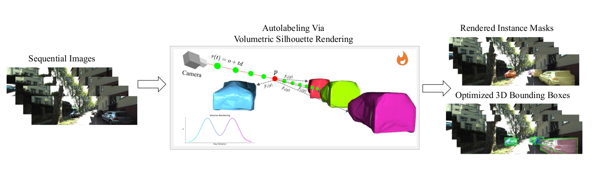

# VSRD++: Autolabeling for 3D Object Detection via Instance-Aware Volumetric Silhouette Rendering

[](https://arxiv.org/abs/2512.01178)

VSRD++ is an advanced weakly supervised 3D object detection framework that extends the original VSRD (Volumetric Silhouette Rendering) method with dynamic object modeling capabilities. The system operates in a two-stage pipeline: **Multi-View 3D Auto-Labeling** followed by **Monocular 3D Detection Training**.

## Overall Pipeline

<div align="center">
  
</div>

---

## 🚀 Key Features

- **Dynamic Object Modeling**: Three modeling approaches for handling dynamic objects
  - Instance Residual Field (via MLP)
  - Vector Velocity Modeling
  - Scalar Velocity Modeling
- **Multi-View Optimization**: Scene-wise 3D bounding box rendering using multiple camera views
- **Weak Supervision**: Only requires 2D segmentation masks and camera poses
- **Robustness Enhancement**: MaskEroder functionality for simulating imperfect mask quality
- **Complete Pipeline**: From data preprocessing to evaluation, all tools included

---

## 📋 Table of Contents

- [Installation](#installation)
- [Data Preparation](#data-preparation)
- [System Architecture](#system-architecture)
- [Quick Start](#quick-start)
- [Detailed Workflow](#detailed-workflow)
- [Configuration](#configuration)
- [Evaluation](#evaluation)
- [Advanced Features](#advanced-features)
- [Sub-modules](#sub-modules)

---

## 🔧 Installation

### 1. Setup Conda Environment

```bash
conda env create -f environment.yaml
conda activate vsrd_plus_plus  # or your environment name
```

### 2. Install Repository

```bash
pip install -e .
```

---

## 📦 Data Preparation

### 1. Download KITTI360 Dataset

Download the custom KITTI360 dataset from [Google Drive](https://drive.google.com/file/d/1syBPCdU0Hs2AWgQfsPohqMFXNEpM3eWV/view?usp=sharing) or use curl:

```bash
curl -H "Authorization: Bearer <YOUR_TOKEN>" \
     https://www.googleapis.com/drive/v3/files/1syBPCdU0Hs2AWgQfsPohqMFXNEpM3eWV?alt=media \
     -o KITTI360_For_Upload.zip
```

### 2. Extract and Organize Data

```bash
# Unzip the dataset
unzip KITTI360_For_Upload.zip

# Remove existing soft links (if any)
find <dataset_path> -type l -exec rm -v {} +
```

### 3. Create Soft Links for Training

```bash
cd preprocessing/data_organization
python soft_link.py \
    --soft_linked_folder $your_target_path \
    --source_root_folder $your_source_path
```

### 4. Update Configuration Files

```bash
# Update dynamic filenames and sample filenames
python update_sampled_image_filenames.py \
    --gt_original_root_folder $your_root_path \
    --changed_root_folder_root $your_changed_root_path

# Update config files
python update_configs.py \
    --root_path <dataset_path> \
    --configs_path Optimized_Based/configs
```

---

## 🏗️ System Architecture

VSRD++ follows a **two-stage pipeline**:

### Stage 1: Multi-View 3D Auto-Labeling
- **Input**: Sequential 2D images, segmentation masks, camera poses
- **Process**: Optimization-based volumetric rendering with dynamic object modeling
- **Output**: 3D bounding box pseudo-labels in KITTI format

### Stage 2: Monocular 3D Detection Training
- **Input**: Pseudo-labels from Stage 1
- **Process**: Train monocular 3D detectors (WeakM3D, MonoFlex, MonoDeTR, etc.)
- **Output**: Trained monocular 3D detection models

```
┌─────────────────┐     ┌──────────────────┐     ┌─────────────────┐
│  Preprocessing  │ --> │  Stage 1:        │ --> │  Stage 2:       │
│  - Flow/Depth   │     │  Multi-View      │     │  Monocular 3D   │
│  - Dynamic Mask │     │  Auto-Labeling    │     │  Detection      │
│  - Attributes   │     │  (VSRD++)         │     │  Training       │
└─────────────────┘     └──────────────────┘     └─────────────────┘
```

---

## 🚀 Quick Start

### Stage 1: Multi-View 3D Auto-Labeling Training

```bash
cd Optimized_Based/scripts
sh DDP_RUN.sh
```

The script contains two training modes:
- **`TRAIN_DDP_VSRDPP`**: With attribute initialization (IGEVStereo pretrained)
- **`TRAIN_DDP_VSRD_SIMPLE`**: Without attribute initialization

### Stage 1: Ablation Studies

For ablation studies with custom configurations:

```bash
cd Optimized_Based/scripts
sh DDP_RUN_ROUND1_ABLATION.sh
```

Edit the script to configure:
- `CONFIG_PATH`: Configuration identifier
- `ERODE_RATIO`: Mask erode ratio (0.0-1.0) for robustness testing
- `CKPT_DIRNAME`, `LOG_DIRNAME`, `OUT_DIRNAME`: Custom output paths

---

## 📖 Detailed Workflow

### Phase 1: Preprocessing

#### 1.1 Dynamic/Static Classification

Generate dynamic masks using optical flow and depth consistency:

```bash
cd preprocessing/dyanmic_static_filtering/

# Step 1: Generate GT dynamic labels
python dynamic_mask_gt_generataion.py \
    --seed 1234 \
    --neighbour_sample 16 \
    --image_folder $image_folder \
    --filename_folder $filename_folder \
    --saved_folder $saved_folder \
    --use_multi_thread

# Step 2: Estimate dynamic masks using flow/depth
python preprocess.py \
    --seed 1234 \
    --neighbour_sample 16 \
    --image_folder $image_folder \
    --filename_folder $filename_folder \
    --saved_folder $saved_folder \
    --optical_flow_model_path $flow_model_path \
    --use_multi_thread
```

**Required Models:**
- **Optical Flow**: [MeMFlow (CVPR 2024)](https://github.com/DQiaole/MemFlow)
- **Depth**: [LeaStereo (NeurIPS 2020)](https://github.com/XuelianCheng/LEAStereo)

#### 1.2 Initial Attribute Estimation

Get initial 3D attributes (location, orientation, velocity) from LiDAR:

```bash
cd preprocessing/Initial_Attributes
python Get_Initial_Attributes.py
```

This step provides:
- Initial ROI LiDAR point clouds
- Initial velocity from ICP
- Location and orientation from ROI LiDAR + velocity

#### 1.3 Depth Estimation (Optional)

Generate pseudo depth maps:

```bash
cd preprocessing/scripts
sh generate_pseudo_depth.sh
```

### Phase 2: Stage 1 - Multi-View 3D Auto-Labeling

#### 2.1 Training Configuration

Edit config files in `Optimized_Based/configs/`:

```python
# Enable dynamic modeling
_C.TRAIN.USE_RDF_MODELING = True
_C.TRAIN.USE_DYNAMIC_MASK = True
_C.TRAIN.USE_DYNAMIC_MODELING = True

# Dynamic modeling type: 'mlp', 'vector_velocity', or 'scalar_velocity'
_C.TRAIN.DYNAMIC_MODELING_TYPE = 'vector_velocity'

# Dynamic labels path
_C.TRAIN.DYNAMIC_LABELS_PATH = "<dataset_path>/dynamic_mask.txt"

# Optimization steps
_C.TRAIN.OPTIMIZATION_NUM_STEPS = 3000
_C.TRAIN.OPTIMIZATION_WARMUP_STEPS = 1000
_C.TRAIN.OPTIMIZATION_RESIDUAL_BOX_STEPS = 2000
```

#### 2.2 Training

Standard training command:

```bash
python train_sequence_ddp.py \
    --config_path "00" \
    --device_id 0
```


### Phase 3: Evaluation Pipeline

#### 3.1 Unified Evaluation Pipeline (Recommended)

Run all evaluation steps in one command:

```bash
cd Evaluations/make_predictions_scripts
sh run_evaluation_pipeline.sh
```

This executes:
1. **Step 1**: Generate predictions and GT in JSON format
2. **Step 2**: Convert to KITTI3D `.txt` format
3. **Step 3**: Assign dynamic/static labels
4. **Step 4**: Organize into KITTI3D dataset structure

#### 3.2 Manual Evaluation Steps

**Step 1: Generate Predictions**

```bash
cd Evaluations/make_predictions_scripts
sh make_prediction.sh
```

**Step 2: Convert to KITTI3D Format**

```bash
sh convert_into_kitti_format.sh
```

**Step 3: Dynamic Attribute Assignment**

```bash
sh dynamic_attribute.sh
```

**Step 4: Organize Dataset Structure**

```bash
cd ../dataset_structure_configuration
sh conversion_kitti3d_structure.sh
```

**Step 5: Calculate IoU**

```bash
cd ../stage1_evaluation_scripts
sh get_iou.sh
```

**Step 6: Calculate mAP**

```bash
sh get_mAP.sh
```

### Phase 4: Stage 2 - Monocular 3D Detection

See [Monocular3D/README.md](Monocular3D/README.md) for detailed instructions.

---

## ⚙️ Configuration

### Training Script Arguments

```bash
python train_sequence_ddp.py \
    --config_path "00" \                     # Config identifier
    --device_id 0 \                          # CUDA device ID
    --ckpt_dirname "<HOME>/ckpts" \         # Custom checkpoint directory
    --log_dirname "<HOME>/logs" \            # Custom log directory
    --out_dirname "<HOME>/outputs"           # Custom output directory
```

### Dynamic Modeling Types

1. **MLP-based Residual Field**
   - Uses MLP to learn instance-specific residual fields
   - Good for complex motion patterns

2. **Vector Velocity Modeling**
   - Models velocity as 3D vector
   - Suitable for objects with consistent motion direction

3. **Scalar Velocity Modeling**
   - Models velocity as scalar magnitude
   - Simpler, faster convergence

---

## 📊 Evaluation

### Visualization

#### Projected 3D Boxes Visualization

```bash
cd Evaluations/stage2_visualization_scripts
sh visualization_projected3d.sh
```

Edit the script to set:
- `ERODE_RATIO`: Apply erode to masks during visualization
- `OPTIONS`: `"pd_only"` or `"pd_gt"`

#### BEV Visualization

```bash
sh visualization_bev.sh
```

### Metrics

- **IoU (3D/BEV)**: Intersection over Union for 3D and BEV boxes
- **mAP**: Mean Average Precision at different IoU thresholds
- **Accuracy**: Percentage of boxes above IoU thresholds (0.25, 0.50)

---


### Custom Output Directories

Specify custom paths for checkpoints, logs, and outputs:

```bash
python train_sequence_ddp.py \
    --config_path "ablation_selective" \
    --device_id 0 \
    --ckpt_dirname "<HOME>/ckpts" \
    --log_dirname "<HOME>/logs" \
    --out_dirname "<HOME>/outputs"
```

---

## 📁 Sub-modules

Detailed documentation for each module:

- **[Optimized_Based/](Optimized_Based/README.md)**: Core training code for Stage 1
  - Multi-view 3D auto-labeling
  - Dynamic object modeling
  - Volumetric rendering

- **[preprocessing/](preprocessing/README.md)**: Data preprocessing pipeline
  - Dynamic/static classification
  - Optical flow and depth estimation
  - Initial attribute estimation

- **[Evaluations/](Evaluations/README.md)**: Evaluation tools and metrics
  - Prediction generation
  - KITTI format conversion
  - IoU and mAP calculation
  - Visualization tools

- **[Monocular3D/](Monocular3D/README.md)**: Stage 2 monocular 3D detection
  - Data preprocessing for monocular detectors
  - Training scripts for WeakM3D, MonoFlex, MonoDeTR

---

## 🔬 Ablation Studies

### Main Ablation Settings

1. **Dynamic Modeling**: Enable/disable dynamic object modeling
2. **Pseudo Attribute Initialization**: Use/ignore initial attributes from LiDAR
3. **Mask Quality**: Test with different erode ratios (0.0, 0.05, 0.10)

### Configuration Example

```python
# In Optimized_Based/configs/train_config_*.py

# Dynamic modeling settings
_C.TRAIN.USE_RDF_MODELING = True
_C.TRAIN.USE_DYNAMIC_MASK = True
_C.TRAIN.USE_DYNAMIC_MODELING = True
_C.TRAIN.DYNAMIC_MODELING_TYPE = 'vector_velocity'  # or 'mlp', 'scalar_velocity'

# Dynamic labels path
_C.TRAIN.DYNAMIC_LABELS_PATH = "<dataset_path>/dynamic_mask.txt"
```

---


## 🙏 Acknowledgments

- [MeMFlow](https://github.com/DQiaole/MemFlow) for optical flow estimation
- [IGEVStereo](https://github.com/gangweix/IGEV) for depth estimation
- [InternImage](https://github.com/OpenGVLab/InternImage) for 2D detection
- [VSRD](https://github.com/Magicboomliu/VSRD) for providing the base of this code.


---

