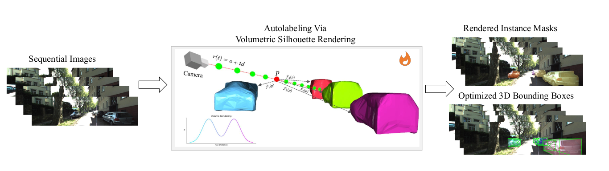

# VSRD++: Autolabeling for 3D Object Detection via Instance-Aware Volumetric Silhouette Rendering

[](https://arxiv.org/abs/2512.01178)

VSRD++ is an advanced weakly supervised 3D object detection framework that extends the original VSRD (Volumetric Silhouette Rendering) method with dynamic object modeling capabilities. The system operates in a two-stage pipeline: **Multi-View 3D Auto-Labeling** followed by **Monocular 3D Detection Training**.

## Overall Pipeline

<div align="center">
  
</div>

---

## Data Preprocessing: Nuscenes Dataset

本节简要说明我们目前为 nuScenes 数据集实现的预处理工作流。整体流程分为两步：

1. **Step 1：生成时序 infos（temporal infos）**
2. **Step 2：在 infos 上区分动态 / 静态目标**

相关脚本均位于 `data_preprocessing/nuscenes/` 目录下。

### Step 1：生成 nuScenes temporal infos

脚本：`data_preprocessing/nuscenes/step1_create_infos.py`  
核心依赖：`data_preprocessing/nuscenes/nuscenes_converter.py`

该步骤会从 nuScenes 官方 raw 数据中提取并打包出训练/验证用的时序信息文件：

- `*_infos_temporal_train.pkl`
- `*_infos_temporal_val.pkl`
- （如有需要）`*_infos_temporal_test.pkl`

每个 `info` 对应 nuScenes 中的一个 **sample（关键帧）**，包含：

- 顶部雷达帧路径：`lidar_path`  
- 历史 sweeps（上一些帧的雷达）及其到当前帧的外参：`sweeps`  
- 6 个相机图像路径及与 LIDAR_TOP 的外参、相机内参：`cams`  
- 自车与全局坐标系的位姿：`lidar2ego_*`, `ego2global_*`  
- CAN bus 时序信息：`can_bus`  
- 在该关键帧上的 3D 标注：`gt_boxes`, `gt_names`, `gt_velocity`, `valid_flag`  
- 时序信息：`scene_token`, `frame_idx`, `prev`, `next`, `timestamp`

运行示例（在仓库根目录）：

```bash
python data_preprocessing/nuscenes/step1_create_infos.py \
  --root_path /path/to/nuscenes \
  --can_bus_root_path /path/to/nuscenes \
  --out_path ./data/nuscenes \
  --info_prefix nuscenes \
  --version v1.0-trainval \
  --max_sweeps 10
```

- `root_path`：nuScenes 主数据根目录（包含 `samples/`, `sweeps/`, `v1.0-trainval/` 等）。
- `can_bus_root_path`：包含 `can_bus/` 子目录的根路径（通常与 `root_path` 相同）。
- `out_path`：输出 infos pkl 的目录。
- `max_sweeps`：对每个关键帧，向前使用的历史雷达帧数量（例如 10 ≈ 0.5s 时间窗口）。

生成后的 `infos_temporal_train/val.pkl` 默认是按 **scene → 时间顺序** 排列的：

- 相同 `scene_token` 的样本连续出现；
- 在每个 scene 内，`frame_idx` 从 0 开始递增，表示该 scene 内的帧序号。

### Step 2：在 infos 中标记动态 / 静态目标

脚本：`data_preprocessing/nuscenes/step2_add_dynamic_flags.py`

该步骤在 Step 1 生成的 infos 基础上，为每个 sample 的每个实例增加一个布尔标记：

- `gt_is_dynamic`：形状与 `gt_names` 相同的 `bool` 数组，表示该实例是否为“动态物体”。

判定规则（可通过命令行参数配置）：

1. 实例必须是有效标注：`valid_flag == True`  
2. 类别在预定义的“可能动态类”中（例如车、卡车、公交、自行车、摩托、行人等）  
3. 在 LIDAR 坐标系下的速度模长 \(\sqrt{v_x^2 + v_y^2}\) 大于给定阈值（默认 0.5 m/s）

运行示例：

```bash
python data_preprocessing/nuscenes/step2_add_dynamic_flags.py \
  --info_path ./data/nuscenes/nuscenes_infos_temporal_train.pkl \
  --speed_thresh 0.5
```

该命令会在同目录下生成：

- `./data/nuscenes/nuscenes_infos_temporal_train_dyn.pkl`

其中的每个 `info` 保留原有字段，并新增：

- `gt_is_dynamic`：`np.bool_` 数组，表示每个实例的动态/静态标签。

可选参数：

- `--out_path`：显式指定输出文件路径。
- `--dynamic_classes`：自定义“可能动态类”列表，逗号分隔，例如：

  ```bash
  --dynamic_classes car,truck,trailer,bus,construction_vehicle
  ```

### 工作流小结

- **Step 1**（`step1_create_infos.py`）：负责从 nuScenes raw 数据中抽取完整的几何、时序和标注信息，构建通用的 temporal infos。  
- **Step 2**（`step2_add_dynamic_flags.py`）：在 infos 基础上进一步分析物体速度和类别，为每个实例打上动态/静态标签，用于后续针对动态目标的建模与分析。  

后续可以基于 `*_infos_temporal_*_dyn.pkl` 继续实现：

- 仅针对动态目标的 auto-labeling / 渲染；
- 动态/静态目标分支建模；
- 不同速度段的细粒度统计和可视化分析。
