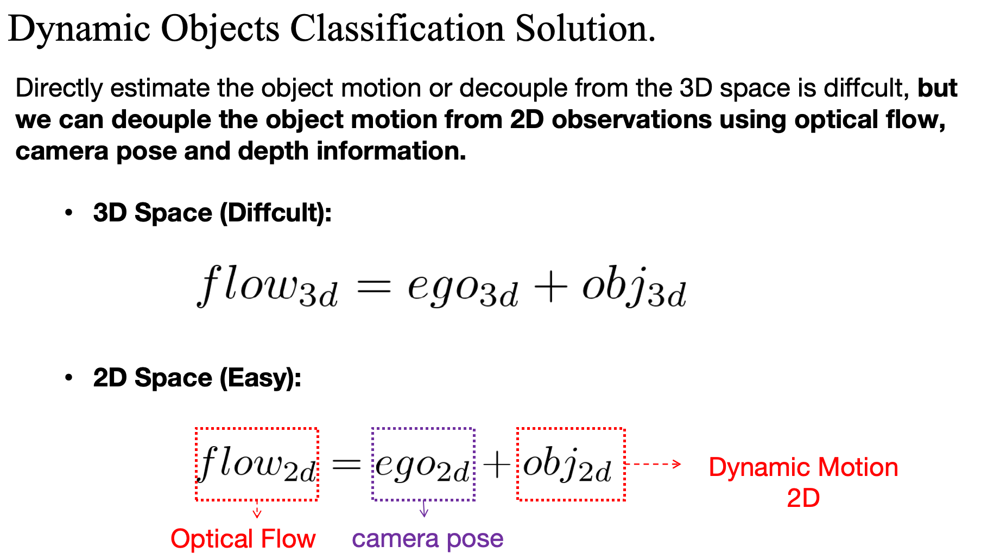
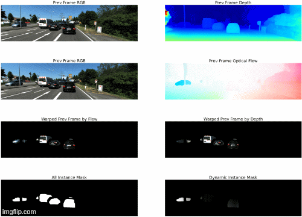

# Dynamic and Static Instance Classification using 2D Flow and Depth Consistency  

- [Slide Information](https://docs.google.com/presentation/d/1UQbSG551w6YL5kPY4Z2d0xizEkc1Kvn7/edit?usp=sharing&ouid=112605403951022205460&rtpof=true&sd=true)


We distinguish the dyanmic and static by looking at the 2D movement observations, where depth denotes the Ego-Motion and Optical Flow denotes the full motion, their relationship can be descripted as follows:



## Get Pretrained Optical Flow and Depth Informnation
- Optical Flow ([MeMFlow(CVPR24)](https://github.com/DQiaole/MemFlow)) 

Download the [pretrained-weight](https://github.com/DQiaole/MemFlow/releases/tag/v1.0.0) here. We provided an API to invoke the optical flow estimators. See the `preprocessing/APIs/optical_flow_estimator.py`

An Simple Example Here: 

```
from preprocessing.APIs.optical_flow_estimator import Load_Optical_Flow_Model

if __name__="__main__":

    model_name = "MeMFlow"
    device = "cuda:0"

    # pretrained model here
    model_path = "/home/zliu/Desktop/CVPR2025/VSRD-V2/data_pre_processing/Dynamic_Static_Clss_Flow_based/MeMFlow/ckpts/MemFlowNet_kitti.pth"
    
    optical_processor,cfg = Load_Optical_Flow_Model(model_name=model_name,device=device,model_path=model_path)
```

- Depth Information ([LeaStereo(NeurIPS20)](https://github.com/XuelianCheng/LEAStereo))

 We provided an API to invoke the depth estimators. See the `preprocessing/APIs/depth_estimator.py` for detailed usage example .   

 ```
from preprocessing.APIs.depth_estimator import Load_Depth_Model

if __name__=="__main__":
    # Loaded the Model
    pretrained_disparity_path = "/home/zliu/CVPR25_Detection/VSRD-V2/preprocessing/disparity_estimation/Leastereo/run"    
    device = 'cuda:0'
    model_name = "LEAStereo"
    model = Load_Depth_Model(model_name=model_name,device=device,model_path=pretrained_disparity_path)
    
 ```

 We can also prepocess the depth information by using the following scripts:  
 ```
 cd preprocessing/scripts  
 sh generate_pseudo_depth.sh
 ```


## Dynamic Static Filtering  

### Step1. Dyanmic Label Generation 

we generate the dyanmic by looking though a seqential image frames which contains the same instane IDs. We calcualte the mean translation error the bounding boxes at different frames with a threshold. The code can be shown as follows:  

```
cd preprocessing/dyanmic_static_filtering/
python dynamic_mask_gt_generataion.py --seed 1234 \ 
        --neighbour_sample 16 \
        --image_folder /media/zliu/data12/dataset/KITTI/VSRD_Format/data_2d_raw/ \
        --filename_folder /media/zliu/data12/dataset/KITTI/VSRD_Format/filenames/R50-N16-M128-B16 \
        --saved_folder /media/zliu/data12/dataset/KITTI/VSRD_Format/dynamic_static/ \
        --use_multi_thread
```

### Step2. Get the Estimated Dyanmic Mask

We using the depth and the optical flow warping consistency to distinguish the dyanmic or static using following scirpts:  

```
cd preprocessing/dyanmic_static_filtering/
python preprocess.py --seed 1234 \ 
        --neighbour_sample 16 \
        --image_folder /media/zliu/data12/dataset/KITTI/VSRD_Format/data_2d_raw/ \
        --filename_folder /media/zliu/data12/dataset/KITTI/VSRD_Format/filenames/R50-N16-M128-B16 \
        --saved_folder /media/zliu/data12/dataset/KITTI/VSRD_Format/dynamic_static/ \
        --optical_flow_model_path /home/zliu/Desktop/CVPR2025/VSRD-V2/data_pre_processing/Dynamic_Static_Clss_Flow_based/MeMFlow/ckpts/MemFlowNet_kitti.pth /
        --use_multi_thread
```

### Step3. Evaluate (Precious / Recall)
```
cd preprocessing/dyanmic_static_filtering/
python evaluation.py
```


### Optional: Debugger
```
cd preprocessing/dyanmic_static_filtering/
python debugger.py
```



### Attribute PreProcessing For Dynamic Objects

Just Test the Initial Attribute Preprocessing.   

Totally is in 3 step:  
- Step1: Get the Initial ROI LiDAR Point Cloud
- Step2: Get the initial Velocity based on ICP and the LiDAR Point Cloud.  
- Step3: Get the Location and the Orientation based on the ROI LiDAR Point Cloud and the Initial Velocity . 

```
python Get_Initial_Attributes.py
```


