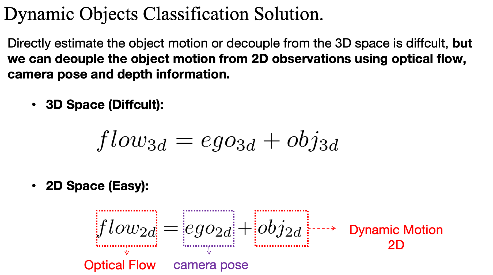
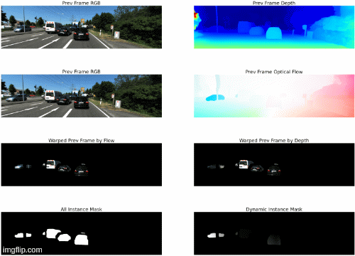

# Dynamic and Static Instance Classification using 2D Flow and Depth Consistency  

- [Slide Information](https://docs.google.com/presentation/d/1UQbSG551w6YL5kPY4Z2d0xizEkc1Kvn7/edit?usp=sharing&ouid=112605403951022205460&rtpof=true&sd=true)


We distinguish the dyanmic and static by looking at the 2D movement observations, where depth denotes the Ego-Motion and Optical Flow denotes the full motion, their relationship can be descripted as follows:



## Get Pretrained Optical Flow and Depth Information

### Optical Flow ([MeMFlow (CVPR24)](https://github.com/DQiaole/MemFlow))

Download the [pretrained weight](https://github.com/DQiaole/MemFlow/releases/tag/v1.0.0), then use the MeMFlow inference code under `preprocessing/optical_flow_estimation/MeMFlow/`.

Example (paths are machine-specific — update `model_path` accordingly):

```python
from preprocessing.APIs.optical_flow_estimator import Load_Optical_Flow_Model

model_name = "MeMFlow"
device = "cuda:0"
model_path = "/path/to/MeMFlow/ckpts/MemFlowNet_kitti.pth"

optical_processor, cfg = Load_Optical_Flow_Model(
    model_name=model_name, device=device, model_path=model_path
)
```

### Depth — WAFT-Stereo (recommended)

Pseudo depth for VSRD++ training is stored as uint16 PNG (`value / 256` = depth in metres). The default output directory name includes the depth model, e.g. `pseudo_depth_ssl_waft_stereo/`.

We wrap [WAFT-Stereo](https://github.com/MemorySlices/WAFT-Stereo) in `preprocessing/apis/depth_estimator.py`. The model code lives in `preprocessing/disparity_estimation/WAFT-Stereo/` and has its **own pixi environment** (PyTorch ≥ 2.0). Run depth inference inside that environment, not the main VSRD++ pixi env.

**Setup (once)**

```bash
cd preprocessing/disparity_estimation/WAFT-Stereo
pixi install
# Weights auto-download from HuggingFace on first run (ckpts/Real/DAv2L-5.pth)
```

**Single-pair inference**

```python
from preprocessing.apis.depth_estimator import Load_Depth_Model

model = Load_Depth_Model("WAFT-Stereo", device="cuda:0")

# left/right image paths, or numpy arrays (H×W×3)
depth_m = model.infer(left_path, right_path)  # float32 (H, W), metres

# KITTI360: auto-pair image_00 -> image_01
depth_m = model.infer_from_left(
    "data_2d_raw/2013_05_28_drive_0000_sync/image_00/data_rect/0000000251.png"
)
```

**Batch generate pseudo depth for KITTI360**

Set `DATASET_ROOT` in `trainer/configs/base.json` (`TRAIN.DATASET.ROOT`), then:

```bash
# All sequences → pseudo_depth_ssl_waft_stereo/
sh preprocessing/scripts/generate_pseudo_depth_waft.sh

# Single sequence
sh preprocessing/scripts/generate_pseudo_depth_waft.sh 0006

# Custom output dir name
OUTPUT_NAME=pseudo_depth_ssl_waft sh preprocessing/scripts/generate_pseudo_depth_waft.sh 0006
```

Or from the WAFT pixi env:

```bash
cd preprocessing/disparity_estimation/WAFT-Stereo
PYTHONPATH=<project_root> pixi run python -m preprocessing.apis.depth_estimator --seq 0006
```

Output layout (relative to dataset root, default dir name `pseudo_depth_ssl_waft_stereo`):

```
pseudo_depth_ssl_waft_stereo/
└── 2013_05_28_drive_0000_sync/
    └── image_00/data_rect/
        ├── 0000000251.png   # uint16, depth_m = pixel / 256
        └── ...
```

Default camera params for KITTI360: `fx=552.554261`, `baseline=0.5942 m`, depth clipped to `[0, 80] m`.

**API reference (`preprocessing/apis/depth_estimator.py`)**

| Function | Description |
|----------|-------------|
| `Load_Depth_Model("WAFT-Stereo", device=...)` | Load model, return `DepthModel` |
| `model.infer(left, right)` | Stereo inference → depth (m) |
| `model.infer_from_left(left_path)` | Auto `image_00` → `image_01` pairing |
| `save_depth_png(depth_m, path)` | Save uint16 PNG for `pseudo_depth_ssl` |
| `generate_pseudo_depth_sequence(seq_dir, ...)` | Batch one sequence |

### Depth — LEAStereo (legacy)

[LEAStereo (NeurIPS20)](https://github.com/XuelianCheng/LEAStereo) is still available under `preprocessing/disparity_estimation/Leastereo/`. It requires manually downloading Kitti15 weights to `Leastereo/run/Kitti15/best/best.pth`.

```bash
bash preprocessing/scripts/generate_pseudo_depth.sh        # all sequences
bash preprocessing/scripts/generate_pseudo_depth.sh 0006  # one sequence
```


## Dynamic Static Filtering  

### Step1. Dyanmic Label Generation 

we generate the dyanmic by looking though a seqential image frames which contains the same instane IDs. We calcualte the mean translation error the bounding boxes at different frames with a threshold. The code can be shown as follows:  

```
cd preprocessing/dyanmic_static_filtering/
python dynamic_mask_gt_generataion.py --seed 1234 \
        --neighbour_sample 16 \
        --image_folder /media/zliu/data12/dataset/KITTI/KITTI360_For_Upload/data_2d_raw/ \
        --filename_folder /media/zliu/data12/dataset/KITTI/KITTI360_For_Upload/filenames/R50-N16-M128-B16 \
        --saved_folder /media/zliu/data12/dataset/KITTI/KITTI360_For_Upload/dynamic_attributes_est/ \
        --use_multi_thread
```

### Step2. Get the Estimated Dyanmic Mask

We using the depth and the optical flow warping consistency to distinguish the dyanmic or static using following scirpts:  

```
cd preprocessing/dyanmic_static_filtering/
python preprocess.py --seed 1234 \
        --neighbour_sample 16 \
        --image_folder /media/zliu/data12/dataset/KITTI/KITTI360_For_Upload/data_2d_raw/ \
        --filename_folder /media/zliu/data12/dataset/KITTI/KITTI360_For_Upload/filenames/R50-N16-M128-B16 \
        --saved_folder /media/zliu/data12/dataset/KITTI/KITTI360_For_Upload/dynamic_attributes_est/ \
        --optical_flow_model_path /path/to/MeMFlow/ckpts/MemFlowNet_kitti.pth \
        --use_multi_thread
```

### Step3. Evaluate (Precious / Recall)
```
cd preprocessing/dyanmic_static_filtering/
python evaluation.py
```


### Optional: Debugger
```
cd preprocessing/dyanmic_static_filtering/
python debugger.py
```



### Attribute PreProcessing For Dynamic Objects

Just Test the Initial Attribute Preprocessing.   

Totally is in 3 step:  
- Step1: Get the Initial ROI LiDAR Point Cloud
- Step2: Get the initial Velocity based on ICP and the LiDAR Point Cloud.  
- Step3: Get the Location and the Orientation based on the ROI LiDAR Point Cloud and the Initial Velocity . 

```
python Get_Initial_Attributes.py
```


