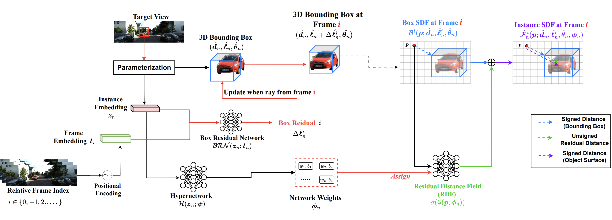
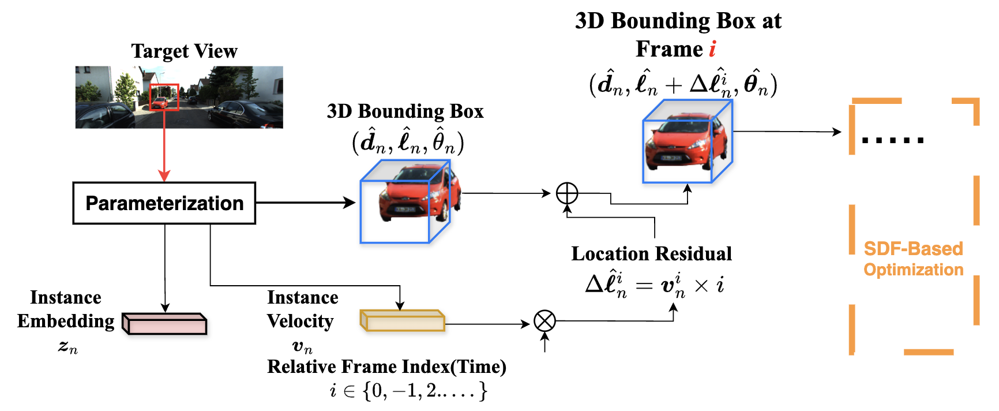

# Stage 1: Multi-View 3D Auto-Labeling (VSRD++)

Optimization-based scene-wise multi-view 3D bounding box rendering with dynamic object modeling.

Dynamic modeling options (set `DYNAMIC_MODELING_TYPE` in `configs/base.json`):

- **MLP** — instance residual field
- **vector_velocity** — 3D velocity vector (default)
- **scalar_velocity** — scalar speed

[Slides](https://docs.google.com/presentation/d/1B2l-yRS63q4lu8Qb-4qCMdWHLMMMLU5L/edit?usp=sharing&ouid=112605403951022205460&rtpof=true&sd=true)




---

## Prerequisites

1. Set `TRAIN.DATASET.ROOT` in `configs/base.json` to your KITTI360 root.
2. Generate **WAFT pseudo depth** under `pseudo_depth_ssl_waft_stereo/` (required for attribute initialization in `train.py`).
3. **Do not** need `dynamic_mask.txt` for training — dynamic/static is inferred online from GT 3D bbox velocity (`||v|| >= 0.20 m/frame`, same rule as [preprocessing/Dynamic_Labels](../preprocessing/Dynamic_Labels/)).

Verify paths from repo root:

```bash
pixi run test-data
```

---

## Training scripts

| Script | When to use |
|--------|-------------|
| **`train.py`** | Standard training (recommended): pseudo-depth init + online dynamic/static |
| **`train_no_init.py`** | Ablation: skip `estimate_initial_attributes()` (no depth/LiDAR init) |
| **`train_ablation.py`** | Ablation: mask erode via `--erode_ratio` (robustness to noisy masks) |
| **`train_sharded.py`** | 64-way data split for cluster jobs (`SPLITS64/sub_XX`) |

### Standard training (single GPU)

```bash
cd trainer
CUDA_VISIBLE_DEVICES=0 torchrun \
  --rdzv_backend c10d --rdzv_endpoint localhost:29500 \
  --nnodes 1 --nproc_per_node 1 \
  train.py --config_path sequence_07 --device_id 0
```

### Weights & Biases (optional)

Enable wandb logging (losses/metrics; optional PD-vs-GT 3D box overlays):

Recommended: set your `WANDB_API_KEY` locally via `.env` (never commit):

```bash
cd /home/zliu/IJCV/VSRD_plus_plus
cp .env.sample .env
# edit .env and set WANDB_API_KEY=...
```

```bash
pixi run train -- --config_path sequence_07 --device_id 0 --wandb --wandb_entity "liuzihua1004" --wandb_project "VSRD-plus-plus" --wandb_log_images
```

From repo root:

```bash
pixi run train -- --config_path sequence_07 --device_id 0
```

`--config_path` accepts `sequence_07`, bare id `07`, `smoke`, `ablation_selective`, etc.

### Custom output directories

```bash
train.py \
  --config_path sequence_07 \
  --device_id 0 \
  --ckpt_dirname /path/to/ckpts \
  --log_dirname  /path/to/logs \
  --out_dirname  /path/to/outs
```

Default (when flags omitted): `trainer/ckpts/{MODEL_TYPE}/`, `trainer/logs/`, `trainer/outs/` — each frame gets a subfolder under the dataset-relative image path.

### Smoke test

Same code path as `train.py`, config `smoke.json` (sequence_00 by default). Hyperparameters come from `base.json`; use a **short** `FILENAMES` list for a quick run.

```bash
pixi run train-smoke
# or
cd trainer/scripts && sh train_smoke.sh
```

Optional env vars: `CKPT_DIRNAME`, `LOG_DIRNAME`, `OUT_DIRNAME`, `CONFIG_PATH`, `CUDA_VISIBLE_DEVICES`.

### Ablation examples

```bash
# Without attribute initialization
pixi run train-no-init -- --config_path sequence_07 --device_id 0

# Mask erode (5%)
pixi run train-ablation -- --config_path ablation_selective --device_id 0 --erode_ratio 0.05
```

### Sharded training (cluster)

```bash
train_sharded.py --config_path 48 --device_id 0 \
  --saved_ckpt_path /path/to/output_models
```

Uses `configs/SPLITS64/split_sub.json` and `train_tsubame_filenames/filename_split64/sub_XX.txt`.

---

## Shell scripts (`trainer/scripts/`)

| Script | Purpose |
|--------|---------|
| `train.sh` | Launch `train.py` or `train_no_init.py` (`MODE=no_init` for ablation) |
| `train_smoke.sh` | Single-GPU smoke test |
| `train_ablation.sh` | `train_ablation.py` + `ERODE_RATIO` env var |
| `train_sharded.sh` | `train_sharded.py` |
| `train_tsubame.sh` | Tsubame cluster job template |
| `lib.sh` | Shared launcher (`ensure_pixi`, `run_train_job`, wandb flags) |

Pixi shortcuts: `pixi run train-shell`, `pixi run train-smoke`.

**wandb via shell env** (handled by `lib.sh`):

| Variable | Effect |
|----------|--------|
| `USE_WANDB=1` or `WANDB=1` | Enable `--wandb` |
| `WANDB_LOG_IMAGES=1` | Add `--wandb_log_images` (`train.py` / `train.sh` init mode only) |
| `WANDB_PROJECT` | Project name |
| `WANDB_ENTITY` | Team/entity |
| `WANDB_NAME` | Run name |
| `WANDB_TAGS` | Comma-separated tags |

Default run name (if you don't set `WANDB_NAME` / `--wandb_name`):  
`{config_path}-{hostname}-{YYYYMMDD-HHMMSS}` (e.g. `ablation_selective-megumi-20260702-160512`).

```bash
USE_WANDB=1 WANDB_LOG_IMAGES=1 WANDB_ENTITY=liuzihua1004 WANDB_PROJECT=VSRD-plus-plus \
pixi run bash trainer/scripts/train_smoke.sh
```

Example with explicit output directories (recommended layout):

```bash
CKPT_DIRNAME=/media/zliu/data12/IJCV/vsrdpp/ckpts \
LOG_DIRNAME=/media/zliu/data12/IJCV/vsrdpp/logs \
OUT_DIRNAME=/media/zliu/data12/IJCV/vsrdpp/outs \
USE_WANDB=1 WANDB_LOG_IMAGES=1 \
pixi run bash trainer/scripts/train.sh
```

You can also set a readable run name (two equivalent ways):

```bash
# 1) via env var
WANDB_NAME="seq10-debug" USE_WANDB=1 pixi run bash trainer/scripts/train.sh

# 2) pass-through CLI args to python entrypoint
USE_WANDB=1 pixi run bash trainer/scripts/train.sh --wandb_name "seq10-debug"
```

Tip: you may also run `bash trainer/scripts/train.sh` directly — the script will auto re-exec itself under `pixi run` (unless `VSRD_SKIP_PIXI=1`).

---

## Configuration

JSON configs under `trainer/configs/`:

```
configs/
├── base.json              # defaults + DATASET.ROOT (edit first)
├── sequence_XX.json       # one KITTI360 sequence per file
├── smoke.json             # smoke test (short FILENAMES recommended)
├── ablation_selective.json
├── ablation_full.json
├── inference.json
└── SPLITS64/split_sub.json
```

Example `sequence_07.json` — only `FILENAMES` is required:

```json
{
  "TRAIN": {
    "DATASET": {
      "FILENAMES": [
        "filenames/R50-N16-M128-B16/2013_05_28_drive_0007_sync/sampled_image_filenames.txt"
      ]
    }
  }
}
```

`load_config("sequence_07")` auto-derives `DYNAMIC_LABELS_PATH` for validator/compare scripts only.

Key flags in `base.json`:

```json
{
  "TRAIN": {
    "MODEL_TYPE": "with_pseudo_depth_ssl_igevstereo",
    "USE_RDF_MODELING": true,
    "USE_DYNAMIC_MASK": true,
    "USE_DYNAMIC_MODELING": true,
    "DYNAMIC_MODELING_TYPE": "vector_velocity",
    "OPTIMIZATION_NUM_STEPS": 3000
  }
}
```

Load in Python:

```python
from trainer.configs import load_config
cfg = load_config("07")
```

Path constants: [preprocessing/dataset_paths.py](../preprocessing/dataset_paths.py).

---

## Inference & evaluation

```bash
cd trainer
python inference.py
python evaluation.py
```

Use config `inference.json` (loaded as `conf_val` in those scripts). See [validator/README.md](../validator/README.md) for Stage 1 metrics (IoU, mAP) after training.

---

## Quick GT visualization (projected 3D boxes + BEV)

Use this to sanity-check camera conventions / GT orientation against the raw image.

```bash
pixi run python trainer/visualize_gt.py --config_path ablation_selective --index 0 --draw_masks
```

---

## Training vs validator: dynamic labels

| Stage | Dynamic/static source |
|-------|------------------------|
| **Training** | Online from GT 3D bbox velocity (threshold 0.20 m/frame) |
| **Validator** | Reads `dynamic_attributes_est_gt/<sequence>/dynamic_mask.txt` |

Generate labels before evaluation:

```bash
pixi run gen-dynamic
python scripts/compare_dynamic_mask_gt.py --config sequence_07
```
